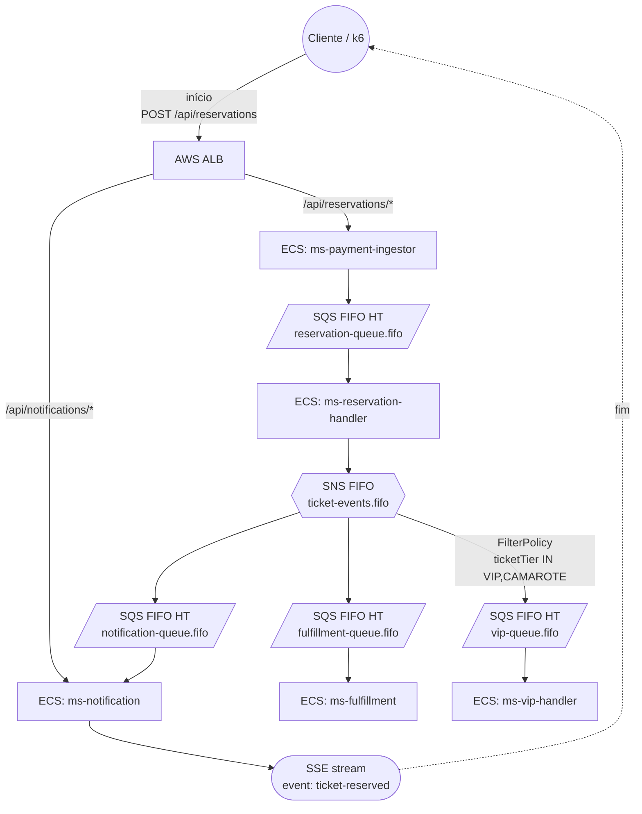

# Distribuindo Eventos com AWS SNS + SQS

Projeto prático construído sobre os conceitos do artigo [**Distribuindo Eventos com AWS SNS + SQS**](https://devsuperior.com.br/blog/distribuindo-eventos-com-aws-sns-sqs) da DevSuperior, **Episódio 2 da série "Dominando Mensageria na AWS"**, aplicados a um cenário onde a ordem importa:

- com 4 filas FIFO em High Throughput Mode
- payload-based filter
- 5 microsserviços rodando em ECS Fargate

> Guia completo passo a passo: [DEMO.md](DEMO.md)

## Sumário

- [Sobre este projeto](#sobre-este-projeto)
- [O que muda em relação ao artigo?](#o-que-muda-em-relação-ao-artigo)
- [Microsserviços](#microsserviços)
- [Arquitetura](#arquitetura)
- [Pré-requisitos](#pré-requisitos)
- [Deploy completo](#deploy-completo)
- [Smoke test e exemplos cURL](#smoke-test-e-exemplos-curl)
- [Portas dos serviços](#portas-dos-serviços)
- [Custos AWS](#custos-aws)
- [Tempo de deploy](#tempo-de-deploy)
- [Cleanup](#cleanup)

---

## Sobre este projeto

Nosso projeto evoluiu e agora tem um próposito somos um **Sistema de Reserva de Ingressos**.

Quando o show da artista X abre vendas, milhares de fãs disparam reservas em segundos. O sistema precisa garantir duas coisas que SNS + SQS Standard não dão por padrão: 
 - ordem por show (quem clicou primeiro no show X tem prioridade)
 - deduplicação automática (se o front cliente reenviar a mesma `reservationId` por timeout de rede, o sistema não cria duas reservas).
 
Para resolver, trocamos Standard por FIFO em High Throughput Mode com `MessageGroupId=showId`, o que mantém ordem dentro do show e ainda paraleliza shows diferentes em até 9.000 mensagens por segundo por show.

O artigo no blog usa um cenário simples (pagamento Stripe) para introduzir broker, fan-out e `RawMessageDelivery`. Este projeto aplica os mesmos conceitos a um caso onde a ordem importa, e ainda adiciona um quinto microsserviço que recebe apenas reservas de tier premium graças a `payload-based filter` na subscription SNS (`FilterPolicyScope=MessageBody`). Em vez de filtrar no consumidor (desperdício computacional), o broker entrega na `vip-queue.fifo` apenas o subconjunto que interessa.

## Então, o que muda em relação ao artigo?

- **Deploy em AWS real**: ECR + ECS Fargate + ALB com path routing, provisionados via 3 stacks CloudFormation independentes.
- **SNS Topic FIFO** (`sns-poc-ticket-events.fifo`) em vez de Standard, com `ContentBasedDeduplication=true`.
- **ALB com 2 rotas path-based** (`/api/reservations/*` para o ingestor, `/api/notifications/*` para o stream SSE com stickiness habilitado).
- **4 filas SQS FIFO em High Throughput Mode** (`DeduplicationScope=messageGroup`, `FifoThroughputLimit=perMessageGroupId`), cada uma com `ContentBasedDeduplication=true`, suportando até 9.000 msg/s por `MessageGroupId`.
  - **`MessageGroupId=showId`** em todas as publicações: ordem dentro de cada show, paralelização entre shows distintos.
  - **`MessageDeduplicationId=reservationId`** explícito no envio do ingestor, com fallback automático via `ContentBasedDeduplication` para hops internos do fan-out.
- **Payload-based filter** (`FilterPolicyScope=MessageBody`, `FilterPolicy={"ticketTier":["VIP","CAMAROTE"]}`) na subscription do `ms-vip-handler`, aplicado pelo broker antes da entrega.
  - **5º microsserviço, ms-vip-handler**, recebe apenas reservas com `ticketTier IN [VIP, CAMAROTE]` e emite credencial digital + agenda concierge (apenas log, didático).
- **Teste de carga com Grafana k6** distribuindo 200 VUs entre 5 `showIds` distintos para evidenciar paralelização visível por show.

## Microsserviços

| Serviço | Porta | Endpoint público (via ALB) | Descrição |
| --- | --- | --- | --- |
| `ms-payment-ingestor` | 8081 | `POST /api/reservations` | Recebe a reserva, propaga `X-Correlation-ID` e enfileira em `reservation-queue.fifo` com `MessageGroupId=showId`. |
| `ms-reservation-handler` | 8082 | nenhum | Consome `reservation-queue.fifo`, valida estoque, calcula total e publica `TicketReservedEvent` no topic FIFO. |
| `ms-notification` | 8083 | `GET /api/notifications/stream/{reservationId}` (SSE) | Consome `notification-queue.fifo` e empurra eventos em tempo real via `SseEmitter` por `reservationId`. |
| `ms-fulfillment` | 8084 | nenhum | Consome `fulfillment-queue.fifo` e loga a liberação dos ingressos. |
| `ms-vip-handler` | 8085 | nenhum | Consome `vip-queue.fifo` (filtrada pelo broker para `VIP`/`CAMAROTE`), emite credencial digital e agenda concierge. |

## Arquitetura

Visão completa do cloud:



A `reservation-queue.fifo` não assina o topic. Ela é uma fila ponto-a-ponto que conecta o ingestor ao reservation-handler. O fan-out começa quando o reservation-handler publica `TicketReservedEvent` no topic FIFO `ticket-events.fifo`, e o broker SNS entrega em paralelo para `notification-queue.fifo`, `fulfillment-queue.fifo` e (quando o filtro casa) `vip-queue.fifo`.

## Pré-requisitos

- **AWS CLI v2** autenticado, região padrão `us-east-1`.
- **Docker Desktop** rodando, para build/push das imagens ao ECR e para o k6 em container.
- **Java 25** + Maven Wrapper, já no repositório.
- **GitBash** (Windows) ou bash (Linux/macOS). Alguns comandos AWS CLI usam `MSYS_NO_PATHCONV=1` no Windows para evitar conversão de paths Unix como `/ecs/...`.

## Deploy completo

Um único comando orquestra ECR (5 repositórios), build e push das 5 imagens, messaging (SNS FIFO + 4 SQS FIFO + 3 subscriptions com filtro na vip) e ECS (5 services, ALB com 2 rotas):

```bash
./scripts/deploy.sh
```

Tempo médio: 12 a 15 minutos. Trecho final da saída:

```
============================================================
Deploy concluido!
  ALB:           http://alb-poc-*.us-east-1.elb.amazonaws.com
  SSE Stream:    http://alb-poc-*.us-east-1.elb.amazonaws.com/api/notifications/stream/{reservationId}
  Cluster:       ecs-poc-cluster
  Topic:         sns-poc-ticket-events.fifo
============================================================
```

Para rodar cada etapa manualmente e entender cada comando, siga o guia em [DEMO.md](DEMO.md).

## Smoke test e exemplos cURL

Reserva ponta a ponta com `correlationId` explícito:

```bash
curl -X POST $ALB_URL/api/reservations \
  -H "Content-Type: application/json" \
  -H "X-Correlation-ID: demo-001" \
  -d '{
        "reservationId":"a1b2c3d4-e5f6-7890-1234-567890abcdef",
        "showId":"show_taylor_2026_sao_paulo_2026_05_15",
        "ticketTier":"VIP",
        "quantity":2,
        "unitPriceUsd":380.00,
        "buyerEmail":"buyer@example.com",
        "requestedAt":"2026-05-02T14:31:22Z"
      }'
```

Resposta esperada (`202 Accepted`):

```json
{"status":"accepted","correlationId":"demo-001","reservationId":"a1b2c3d4-e5f6-7890-1234-567890abcdef"}
```

Stream SSE em tempo real para acompanhar a confirmação da reserva (`reservationId` no path):

```bash
curl -N $ALB_URL/api/notifications/stream/a1b2c3d4-e5f6-7890-1234-567890abcdef
```

Saída esperada (chega após o reservation-handler processar e publicar o evento de domínio):

```
event:ticket-reserved
data:{"reservationId":"a1b2c3d4-e5f6-7890-1234-567890abcdef","showId":"show_taylor_2026_sao_paulo_2026_05_15","ticketTier":"VIP","quantity":2,"totalAmountUsd":820.80,"buyerEmail":"buyer@example.com","reservedAt":"2026-05-02T14:31:22.987Z"}
```

Smoke test automatizado (envia 1 reserva, espera as 4 filas zerarem, busca o `correlationId` nos 4 log groups):

```bash
./scripts/smoke-test.sh
```

## Portas dos serviços

| Serviço | Porta local | Endpoint público (via ALB) |
| --- | --- | --- |
| `ms-payment-ingestor` | 8081 | `POST /api/reservations` |
| `ms-reservation-handler` | 8082 | nenhum (consumidor SQS + publisher SNS) |
| `ms-notification` | 8083 | `GET /api/notifications/stream/{reservationId}` (SSE) |
| `ms-fulfillment` | 8084 | nenhum (consumidor SQS) |
| `ms-vip-handler` | 8085 | nenhum (consumidor SQS, filtrado) |

## Custos AWS

A stack mantém recursos pagos rodando enquanto provisionada: ALB (cobrança fixa por hora), ECS Fargate (5 tasks Linux/x86), CloudWatch Log Groups, e tráfego entre AZs. Custo estimado: **USD 1 a 3 por dia** com a stack de pé. Sempre execute o cleanup ao fim de cada uso.

## Tempo de deploy

- Stack `sns-sqs-filter-fifo-poc-ecr`: 1 a 2 minutos.
- Build e push das 5 imagens Docker para o ECR: 3 a 5 minutos (depende do cache local).
- Stack `sns-sqs-filter-fifo-poc-messaging`: 1 a 2 minutos.
- Stack `sns-sqs-filter-fifo-poc-ecs` (VPC, ALB, 5 services Fargate): 5 a 7 minutos.

Total: **12 a 15 minutos** de deploy.

## Cleanup

```bash
./scripts/cleanup.sh
```

Destrói tudo em paralelo: ECS, ECR (com force delete das 5 imagens), messaging (SNS FIFO + 4 SQS FIFO) e os 5 log groups remanescentes. Detalhes do passo a passo manual estão na seção 9 do [DEMO.md](DEMO.md).

**Execute ao fim de cada uso para evitar cobranças.**
